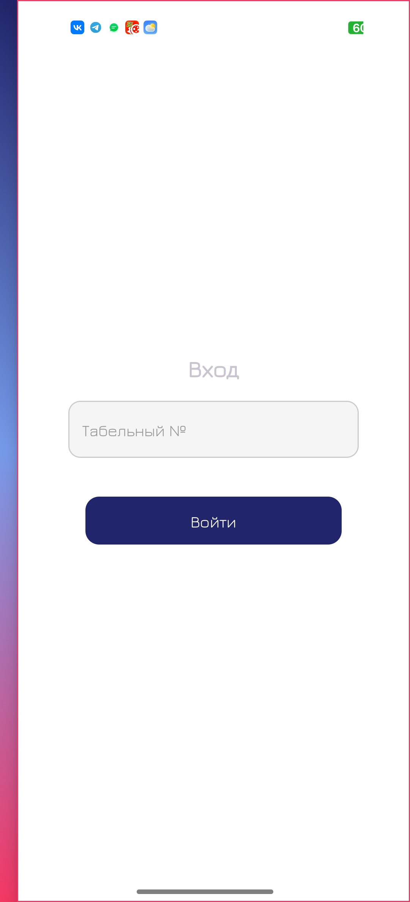
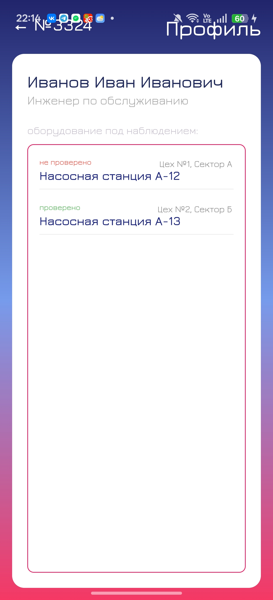
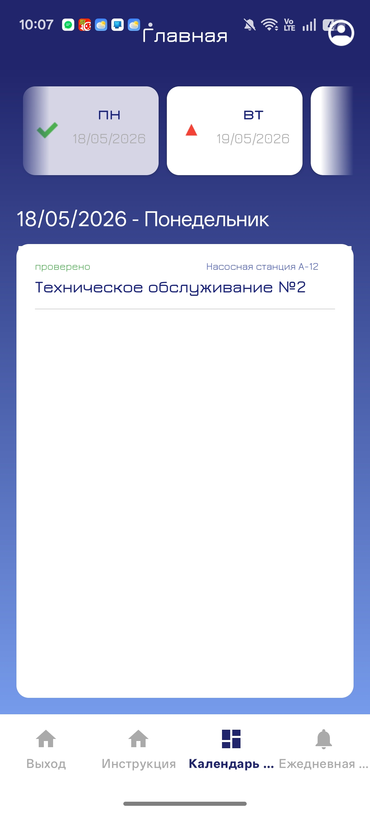
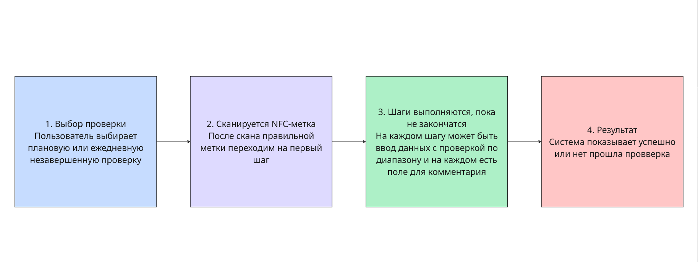
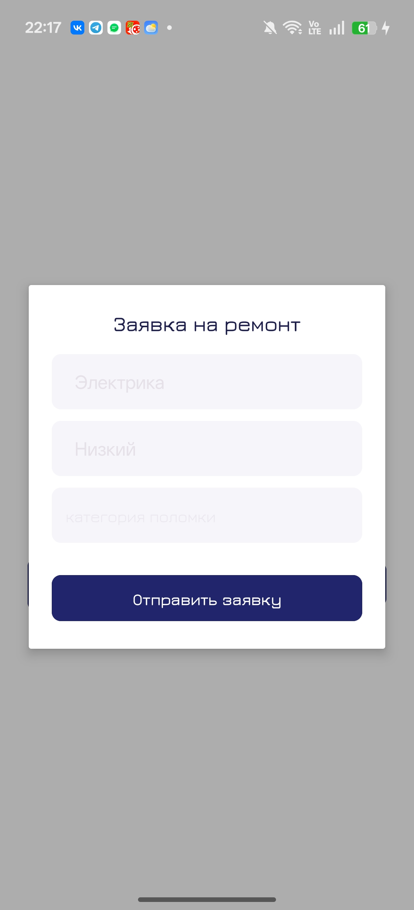

# ЗаводКонтроль

## Аннотация

**«ЗаводКонтроль»** — мобильное Android-приложение для контроля регламентных проверок оборудования на промышленном предприятии. Система помогает работникам выполнять ежедневные и плановые проверки с использованием NFC-меток, фиксировать результаты осмотра, прикреплять фотографии, добавлять пояснения, выявлять дефекты и создавать заявки на ремонт.

Приложение является частью программно-аппаратного комплекса, включающего мобильную клиентскую часть, серверное API, базу данных PostgreSQL и административный модуль. Администратор использует систему для управления расписаниями проверок, пользователями, оборудованием, заявками, логами и отчётностью.

Основная задача приложения — обеспечить подтверждённое выполнение проверок оборудования и исключить фиктивное прохождение контрольных точек.

---

## Предупреждение по запуску

**Запускать приложение следует на реальном Android-устройстве, а не на эмуляторе.**

Это связано с тем, что для работы приложения требуется поддержка NFC-модуля и физическое считывание NFC-меток, закреплённых на оборудовании.

Также важно:

- устройство с сервером и телефон с приложением должны находиться в одной локальной сети;
- серверная часть на текущем этапе запускается локально;
- IP-адрес сервера необходимо указывать в `app/build.gradle.kts`;
- для определения IP-адреса компьютера с сервером можно выполнить команду:

```powershell
ipconfig
```

В `BASE_URL` необходимо указать IP-адрес компьютера, на котором запущен сервер FastAPI:

```kotlin
buildConfigField(
    "String",
    "BASE_URL",
    "\"http://192.168.31.200:8000/\""
)
```

Если приложение запускается на телефоне, подключённом к той же Wi-Fi сети, необходимо использовать IPv4-адрес Wi-Fi-адаптера компьютера. Если ноутбук подключён к интернету через точку доступа телефона, IP-адрес может измениться, поэтому его нужно проверить повторно.

Сервер должен быть запущен с доступом по сети, например:

```powershell
uvicorn main:app --host 0.0.0.0 --port 8000
```


---

## Введение

Приложение предназначено для повышения безопасности производственного процесса и контроля соблюдения регламентов эксплуатации оборудования на промышленном предприятии, например на участках предприятия типа «КП Сплав».

Система ориентирована на использование в условиях реального производства, где важно не только зафиксировать факт выполнения проверки, но и подтвердить физическое присутствие работника возле оборудования. Для этого используется NFC-идентификация: каждая проверка начинается и подтверждается через NFC-метку, закреплённую на объекте контроля.

Пользовательский интерфейс приложения был спроектирован с учётом пожеланий заказчика и условий эксплуатации на промышленном объекте. При разработке учитывались необходимость быстрого доступа к основным действиям, читаемость интерфейса, минимизация количества лишних экранов, возможность использования приложения непосредственно на производственном участке, а также логика работы сотрудников при проведении регламентных осмотров оборудования.

Основные возможности приложения:

- авторизация сотрудника по табельному номеру;
- отображение личного профиля работника;
- отображение оборудования, закреплённого за сотрудником;
- проведение ежедневных проверок оборудования;
- проведение плановых проверок по расписанию;
- подтверждение начала и этапов проверки через NFC-метки;
- отображение подсказок с расположением NFC-меток;
- ввод параметров проверки;
- прикрепление фотографии к отдельным шагам проверки;
- добавление пояснения или комментария к результату шага;
- автоматическая проверка корректности введённых данных;
- создание заявки на ремонт при обнаружении дефекта;
- отображение статуса выполнения проверки;
- передача результатов проверки на сервер;
- хранение истории проверок и заявок в базе данных;
- последующее использование данных администратором для отчётности.

> Главное правило работы с программой: проверка считается завершённой только после прохождения всех этапов, подтверждения контрольных точек через NFC и фиксации необходимых данных.

---

## Назначение и условия применения

«ЗаводКонтроль» применяется внутри производственного предприятия для контроля технического состояния оборудования и дисциплины выполнения регламентных проверок.

Программа используется в следующих условиях:

- в производственных цехах и на участках с оборудованием, подлежащим регулярной проверке;
- на мобильных устройствах под управлением Android;
- при наличии NFC-модуля на устройстве работника;
- при наличии NFC-меток, закреплённых на оборудовании;
- при наличии серверной части на FastAPI;
- при подключении серверной части к базе данных PostgreSQL;
- при наличии администратора, который управляет пользователями, расписаниями, заявками и отчётами.

Программа не предназначена для учёта рабочего времени, финансовых операций, расчёта заработной платы или полного управления персоналом. Основное назначение приложения — контроль выполнения технических проверок оборудования.

---

## Технологический стек

### Мобильное приложение

Клиентская часть реализована как Android-приложение на языке **Kotlin**.

Используемые технологии:

- **Kotlin** — основной язык разработки мобильного приложения;
- **Android SDK** — платформа разработки;
- **XML Layouts** — описание пользовательского интерфейса;
- **ViewBinding** — безопасная работа с элементами интерфейса;
- **ViewModel и LiveData** — разделение логики экрана и отображения данных;
- **Retrofit** — обмен данными с серверной частью по REST API;
- **Gson** — сериализация и десериализация JSON;
- **OkHttp** — сетевой клиент;
- **RecyclerView** — отображение списков оборудования, расписаний и дней календаря;
- **CameraX / системная камера** — фотофиксация отдельных шагов проверки;
- **NFC API Android** — считывание NFC-меток;
- **FileProvider** — безопасная передача URI фотографии между компонентами приложения.

### Серверная часть

Серверная часть используется для обработки запросов мобильного приложения, хранения результатов проверок и передачи данных администратору.

Используемые технологии:

- **Python**;
- **FastAPI**;
- **PostgreSQL**;
- **REST API**;
- **JSON**;
- **multipart/form-data** для загрузки фотографий.

---

## Архитектура приложения

Архитектура мобильного приложения построена по принципу разделения ответственности между слоями. Это позволяет упростить сопровождение кода, изолировать работу с сервером от пользовательского интерфейса и сделать приложение более устойчивым к изменениям API.

Основные пакеты приложения:

```text
com.example.zavod
├── adapters
├── api
├── domain
├── model
├── repository
├── service
├── ui
├── util
└── viewmodel
```

### Пакет `api`

Пакет `api` отвечает за сетевое взаимодействие с серверной частью.

В него входят:

- `ApiConfig` — хранит базовый адрес сервера;
- `ApiClient` — создаёт объект Retrofit;
- `ApiService` — описывает REST API endpoints;
- `HintUrlBuilder` — формирует ссылки для загрузки изображений-подсказок.

Пример Kotlin-интерфейса для взаимодействия с сервером:

```kotlin
interface ApiService {

    @POST("check/start/{tagId}/{typeCheck}")
    fun startCheck(
        @Header("Authorization") authorization: String,
        @Path("tagId") tagId: String,
        @Path("typeCheck") typeCheck: String,
        @Query("equipment_id") equipmentId: Int?,
        @Query("template_id") templateId: Int?,
        @Query("schedule_id") scheduleId: Int?
    ): Call<StartResponse>

    @POST("check/step")
    fun checkStep(
        @Body request: StepRequest
    ): Call<StepResult>

    @Multipart
    @POST("/step/upload")
    fun uploadStep(
        @Part("sessionId") sessionId: RequestBody,
        @Part("stepId") stepId: RequestBody,
        @Part("tagId") tagId: RequestBody,
        @Part("value") value: RequestBody,
        @Part("comment") comment: RequestBody,
        @Part photo: MultipartBody.Part
    ): Call<StepResult>

    @POST("repair")
    fun createRepair(
        @Header("Authorization") authorization: String,
        @Body request: RepairRequest
    ): Call<Void>

    @GET("/repair/types")
    fun getRepairTypes(): Call<RepairTypesResponse>

    @POST("/auth/login")
    fun login(
        @Body request: LoginRequest
    ): Call<LoginResponse>

    @GET("profile/{pass_id}")
    fun getProfile(
        @Path("pass_id") passId: String
    ): Call<ProfileResponse>

    @GET("schedule/{pass_id}")
    fun getSchedule(
        @Path("pass_id") passId: String
    ): Call<ScheduleResponse>

    @GET("equipment/{pass_id}")
    fun getEquipment(
        @Path("pass_id") passId: String
    ): Call<EquipmentResponse>
}
```

### Пакет `model`

Пакет `model` содержит классы данных, которые описывают основные сущности приложения:

- сотрудник;
- оборудование;
- расписание;
- шаблон проверки;
- шаг проверки;
- результат шага;
- заявка на ремонт;
- ответ сервера;
- состояние авторизации.

Пример модели сотрудника:

```kotlin
data class Employee(
    var id: Int = 0,

    @SerializedName("full_name")
    var fullName: String? = null,

    var position: String? = null,

    @SerializedName("pass_id")
    var passId: String? = null
)
```

Модели используются при получении данных с сервера и передаче данных обратно в API.

### Пакет `repository`

Пакет `repository` содержит классы, отвечающие за получение и отправку данных. Репозитории скрывают детали работы с Retrofit от ViewModel и экранов приложения.

Основные репозитории:

- `AuthRepository` — авторизация пользователя;
- `ProfileRepository` — загрузка профиля работника;
- `EquipmentRepository` — получение списка оборудования;
- `ScheduleRepository` — получение расписания проверок;
- `StartRepository` — запуск проверки;
- `StepRepository` — обработка шагов проверки;
- `RepairRepository` — создание заявок на ремонт;
- `ServerErrorParser` — обработка ошибок сервера.

Репозитории позволяют отделить бизнес-логику от пользовательского интерфейса. Например, экран не знает, как именно устроен HTTP-запрос, он только вызывает метод репозитория и получает результат.

### Пакет `viewmodel`

Пакет `viewmodel` содержит ViewModel-классы, которые управляют состоянием экранов.

Основные ViewModel:

- `LoginViewModel` — управляет состоянием авторизации;
- `MainViewModel` — отвечает за загрузку ежедневной проверки;
- `ProfileViewModel` — хранит данные профиля;
- `StartViewModel` — запускает проверку после считывания NFC;
- `StepViewModel` — управляет текущим шагом проверки;
- `FinishViewModel` — управляет созданием заявки на ремонт.

Использование ViewModel позволяет сохранять данные экрана отдельно от Activity и Fragment, а также упрощает обновление интерфейса при изменении данных.

### Пакет `ui`

Пакет `ui` содержит экраны приложения.

Основные экраны:

- `LoginActivity` — экран авторизации;
- `MainActivity` — главный экран с нижней навигацией;
- `StartActivity` — экран начала проверки и сканирования стартовой NFC-метки;
- `StepActivity` — экран выполнения шагов проверки;
- `CameraActivity` — экран запуска камеры;
- `FinishActivity` — экран завершения проверки и создания заявки;
- `ProfileFragment` — профиль сотрудника;
- `HomeFragment` — инструкция;
- `DashboardFragment` — расписание проверок.

### Пакет `service`

Пакет `service` содержит сервисные классы для работы с аппаратными возможностями устройства.

В частности:

- `NfcService` — обработка NFC-меток.

NFC используется для подтверждения фактического нахождения сотрудника у оборудования. Это снижает риск фиктивного выполнения проверки.

### Пакет `adapters`

Пакет `adapters` содержит адаптеры для списков:

- `EquipmentAdapter` — список оборудования;
- `ScheduleAdapter` — список плановых проверок;
- `WeekAdapter` — горизонтальный список дат.

### Пакет `util`

Пакет `util` содержит вспомогательные классы:

- `CheckTypeMapper` — нормализация типа проверки;
- `InspectionStatusMapper` — преобразование статусов проверки для отображения в интерфейсе.

---

## Логика работы проверки

Проверка оборудования состоит из нескольких этапов:

1. пользователь выбирает ежедневную или плановую проверку;
2. приложение открывает экран начала проверки;
3. пользователь нажимает «Где метка?» и видит подсказку с расположением NFC-метки;
4. пользователь сканирует стартовую NFC-метку оборудования;
5. сервер проверяет корректность метки и возвращает первый шаг проверки;
6. приложение открывает экран выполнения шагов;
7. пользователь последовательно выполняет инструкции;
8. при необходимости вводит значение, делает фото и добавляет комментарий;
9. каждый шаг подтверждается NFC-меткой;
10. результат шага отправляется на сервер;
11. после последнего шага приложение показывает результат проверки;
12. при наличии замечаний пользователь может создать заявку на ремонт.

Такой сценарий позволяет подтвердить не только факт ввода данных, но и физическое выполнение проверки возле оборудования.

---

## Фотофиксация и пояснения к шагу

Для отдельных шагов проверки предусмотрена возможность прикрепления фотографии и пояснения. Это используется в случаях, когда необходимо визуально подтвердить состояние оборудования или зафиксировать обнаруженный дефект.

Если шаг требует фотофиксации, приложение отображает кнопку камеры. Пользователь выполняет необходимые действия, делает снимок оборудования, добавляет пояснение и подтверждает шаг NFC-меткой.

После этого на сервер отправляются:

- идентификатор сессии проверки;
- идентификатор шага;
- UID NFC-метки;
- введённое значение;
- комментарий пользователя;
- фотография.

Передача фотографии выполняется через `multipart/form-data`.

Пример логики отправки фотографии:

```kotlin
fun uploadPhoto(
    sessionId: String,
    stepId: String,
    tagId: String?,
    value: String?,
    commentValue: String?,
    photoPath: String?,
    callback: RepositoryCallback<StepResult>
) {
    val file = File(photoPath ?: "")

    val textType = "text/plain".toMediaTypeOrNull()

    val session = sessionId.toRequestBody(textType)
    val step = stepId.toRequestBody(textType)
    val tag = (tagId ?: "").toRequestBody(textType)
    val input = (value ?: "").toRequestBody(textType)
    val comment = (commentValue ?: "").toRequestBody(textType)

    val fileBody = file.asRequestBody("image/jpeg".toMediaTypeOrNull())

    val photoPart = MultipartBody.Part.createFormData(
        "photo",
        file.name,
        fileBody
    )

    api.uploadStep(
        session,
        step,
        tag,
        input,
        comment,
        photoPart
    ).enqueue(...)
}
```

---

## Пользовательский интерфейс

Внешний вид приложения разработан с учётом требований заказчика и условий эксплуатации на промышленном предприятии. При проектировании интерфейса учитывались следующие факторы:

- работник должен быстро понимать, какое действие необходимо выполнить;
- основные действия должны быть доступны без лишних переходов;
- элементы интерфейса должны быть крупными и читаемыми;
- навигация должна быть простой и предсказуемой;
- для шагов проверки должна отображаться понятная инструкция;
- при необходимости должна быть доступна подсказка с расположением NFC-метки;
- интерфейс должен быть пригоден для использования непосредственно на производственном участке;
- цветовая индикация должна помогать быстро отличать выполненные, невыполненные и проблемные проверки.

Цветовая логика статусов:

| Статус | Отображение |
| --- | --- |
| Не проверено | Красный цвет |
| Выполняется | Оранжевый цвет |
| Проверено | Зелёный цвет |
| Проверено с замечаниями | Оранжевый / предупреждающий статус |

Такой подход позволяет работнику быстро ориентироваться в состоянии оборудования и проверок.

---

## Установка

### 1. Подготовка серверной части

- [x] установить PostgreSQL;
- [x] создать и настроить базу данных приложения;
- [x] развернуть серверную часть FastAPI;
- [x] запустить сервер с доступом по локальной сети;
- [ ] проверить доступность сервера с телефона.

Пример запуска сервера:

```powershell
uvicorn main:app --host 0.0.0.0 --port 8000
```

### 2. Настройка мобильного приложения

- [x] открыть проект в Android Studio;
- [x] указать IP-адрес сервера в `BASE_URL`;
- [x] собрать APK-файл;
- [x] установить приложение на Android-устройство;
- [ ] проверить наличие NFC-модуля на телефоне.

### 3. Первичная настройка данных

- [x] внести оборудование в базу данных;
- [x] привязать NFC-метки к оборудованию;
- [x] добавить работников;
- [x] привязать работников к оборудованию;
- [x] загрузить расписание проверок;
- [ ] выполнить тестовый вход по табельному номеру.

### 4. Проверка работы

- [x] проверить авторизацию;
- [x] проверить загрузку профиля;
- [x] проверить отображение оборудования;
- [x] проверить расписание;
- [x] проверить сканирование NFC-метки;
- [x] выполнить пробную проверку;
- [x] создать тестовую заявку на ремонт.

---

## Описание операций

### 1. Запуск и вход в систему

После установки приложения в меню телефона появляется иконка «ЗаводКонтроль». Пользователь открывает приложение и вводит табельный номер. При успешной авторизации приложение сохраняет данные пользователя и открывает главное меню.

На главном экране доступны:

- инструкция;
- расписание проверок;
- запуск ежедневной проверки;
- профиль пользователя;
- выход из системы.



### 2. Просмотр профиля

В профиле отображаются:

- табельный номер работника;
- ФИО;
- должность;
- список оборудования, закреплённого за сотрудником.

Из профиля можно перейти к ежедневной проверке оборудования.



### 3. Выбор плановой проверки

Плановые проверки отображаются в разделе расписания. Пользователь может выбрать день в горизонтальном календаре и увидеть список задач на выбранную дату.

Для каждой проверки отображаются:

- название задачи;
- оборудование;
- статус выполнения;
- визуальный индикатор состояния.



### 4. Сканирование NFC-метки

Перед началом проверки пользователь может нажать кнопку «Где метка?». Приложение загружает изображение-подсказку, на котором показано расположение NFC-метки на оборудовании.

После сканирования NFC-метки приложение отправляет UID метки на сервер. Если метка соответствует выбранному оборудованию и типу проверки, сервер возвращает первый шаг проверки.



### 5. Выполнение шагов проверки

На каждом шаге пользователь:

1. читает инструкцию;
2. вводит требуемые параметры;
3. при необходимости делает фотографию;
4. добавляет пояснение;
5. подтверждает выполнение шага NFC-меткой.

Если введённое значение выходит за допустимый диапазон или сервер обнаруживает ошибку, шаг помечается как проблемный. После завершения проверки приложение показывает итоговый результат.

### 6. Завершение проверки

После прохождения всех этапов приложение отображает один из результатов:

- проверка успешно завершена;
- проверка завершена с замечаниями;
- обнаружены ошибки на отдельных шагах.

Если были выявлены проблемы, пользователь может создать заявку на ремонт.

### 7. Создание заявки на ремонт

Для создания заявки пользователь нажимает кнопку «Заявка на ремонт», выбирает вид дефекта, указывает приоритет и добавляет описание проблемы. После отправки заявка сохраняется в базе данных и становится доступной администратору.



### 8. Действия администратора

Администратор выполняет следующие операции через серверную часть и административный модуль:

- управляет пользователями;
- назначает оборудование работникам;
- создаёт и редактирует расписание проверок;
- контролирует выполнение проверок;
- просматривает результаты шагов;
- анализирует замечания и ошибки;
- рассматривает заявки на ремонт;
- выгружает отчёты и статистику;
- контролирует логи системы.

---

## Структура проекта

Примерная структура клиентской части:

```text
app/src/main/java/com/example/zavod
├── adapters
│   ├── EquipmentAdapter.kt
│   ├── ScheduleAdapter.kt
│   └── WeekAdapter.kt
├── api
│   ├── ApiClient.kt
│   ├── ApiConfig.kt
│   ├── ApiService.kt
│   └── HintUrlBuilder.kt
├── domain
│   ├── StartMapper.kt
│   └── StartSession.kt
├── model
│   ├── auth
│   ├── step
│   ├── Employee.kt
│   ├── Equipment.kt
│   ├── Schedule.kt
│   ├── Step.kt
│   └── ...
├── repository
│   ├── AuthRepository.kt
│   ├── EquipmentRepository.kt
│   ├── ProfileRepository.kt
│   ├── RepairRepository.kt
│   ├── ScheduleRepository.kt
│   ├── StartRepository.kt
│   └── StepRepository.kt
├── service
│   └── nfcService
│       └── NfcService.kt
├── ui
│   ├── dashboard
│   ├── home
│   ├── CameraActivity.kt
│   ├── FinishActivity.kt
│   ├── LoginActivity.kt
│   ├── MainActivity.kt
│   ├── ProfileFragment.kt
│   ├── StartActivity.kt
│   └── StepActivity.kt
├── util
└── viewmodel
```

---

## Термины и сокращения

| Термин / сокращение | Английский вариант | Пояснение |
| --- | --- | --- |
| NFC-метка | NFC tag | Пассивное устройство с чипом и антенной, которое передаёт данные на небольшом расстоянии. |
| UID | Unique identifier | Уникальный идентификатор NFC-метки. |
| Верификация | Verification | Подтверждение корректности данных или действия пользователя. |
| Инвентарный номер | Inventory number | Уникальный идентификатор оборудования в учётной системе предприятия. |
| Плановая проверка | Scheduled check | Проверка оборудования, выполняемая по графику. |
| Ежедневная проверка | Daily check | Проверка оборудования, выполняемая каждый день. |
| API | Application Programming Interface | Интерфейс взаимодействия между мобильным приложением и сервером. |
| REST | Representational State Transfer | Архитектурный стиль обмена данными через HTTP-запросы. |
| ViewModel | ViewModel | Компонент Android-архитектуры для хранения состояния экрана. |
| Repository | Repository | Слой приложения, отвечающий за получение и отправку данных. |
| PostgreSQL | PostgreSQL | Реляционная система управления базами данных. |
| FastAPI | FastAPI | Python-фреймворк для разработки серверного API. |

---

## Справочная информация

**Подсказка:** если пользователь не может найти NFC-метку, необходимо нажать кнопку «Где метка?». После этого приложение откроет изображение с расположением метки.

**Важно:** пустые обязательные поля не допускаются. Система потребует заполнить их перед завершением операции.

**Контроль:** ошибки входа, некорректные действия и результаты проверок фиксируются в системе и доступны администратору.

| Ситуация | Действие пользователя | Результат |
|:--|:--|:--|
| Неверный табельный номер | Повторить ввод или обратиться к администратору | Ошибка авторизации устранена |
| Не отображается оборудование | Сообщить мастеру или администратору | Ответственный назначен корректно |
| Не удаётся подключиться к серверу | Проверить IP-адрес, сеть и запуск FastAPI | Подключение восстановлено |
| Не считывается NFC-метка | Проверить NFC на телефоне и расположение метки | Проверка может быть продолжена |
| Не загружается фото | Повторить снимок или проверить разрешение камеры | Фото прикреплено к шагу |
| Заявка не создаётся | Заполнить обязательные поля | Заявка сохранена |

---

## Краткий чек-лист пользователя

- [x] Войти в приложение по табельному номеру.
- [x] Выбрать ежедневную или плановую проверку.
- [x] Найти NFC-метку с помощью подсказки.
- [x] Отсканировать NFC-метку оборудования.
- [x] Выполнить все шаги проверки.
- [x] Ввести необходимые параметры.
- [x] При необходимости сделать фото.
- [x] При необходимости добавить пояснение.
- [x] Подтвердить шаги через NFC.
- [x] Завершить проверку.
- [x] При необходимости создать заявку на ремонт.


</details>
